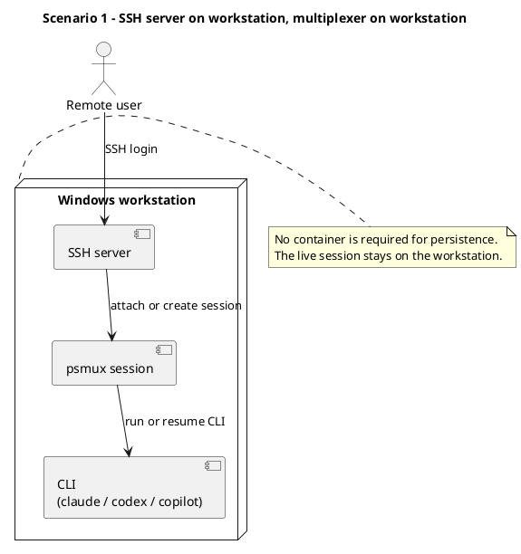
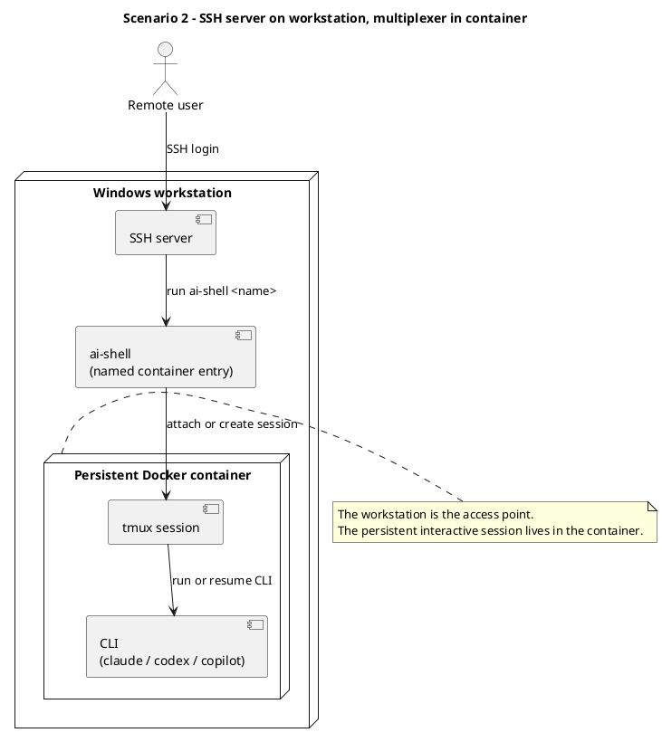
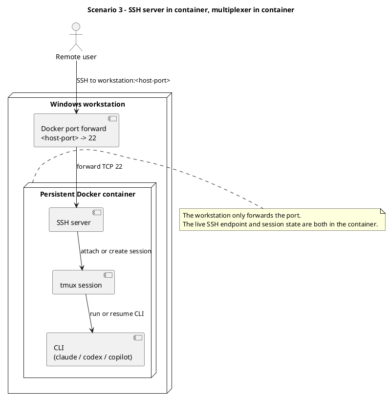

# Access Point and Terminal Multiplexer Scenarios

This note describes three ways to keep long-running CLI sessions reachable later, depending on where the SSH access point and terminal multiplexer live.

## Scenario 1: Access Point and Multiplexer on the Workstation

### Overview

Both the SSH entry point and the terminal multiplexer live on the Windows workstation. In this setup you do not need `ai-shell` for session persistence. You can run `claude`, `codex`, or `copilot` directly on the workstation inside `psmux`.

### PlantUML

In this model, both the SSH server and the terminal multiplexer are on the workstation.



### Preparing Setup

Make sure the workstation is reachable over SSH.

Install and verify `psmux` on the workstation.

From the target workspace on the workstation, start a persistent `psmux` session and launch the CLI inside it.

Example:

```powershell
psmux new -s claude
claude
```

### How To Use It Later

SSH into the workstation.

Reattach to the workstation multiplexer session.

Continue the existing CLI session.

Example:

```powershell
ssh <your-workstation>
psmux attach -t claude
```

## Scenario 2: Access Point on the Workstation, Multiplexer in the Container

### Overview

The workstation is still the SSH entry point, but the persistent terminal multiplexer lives inside a persistent container. This is the standard `ai-shell <name>` plus `tmux` pattern.

### PlantUML

In this model, SSH terminates on the workstation, then you enter the persistent container and attach to `tmux` there.



### Preparing Setup

From the workspace directory you want mounted as `/workspace`, create a persistent named container.

Enter the container and start a `tmux` session.

Start the CLI inside `tmux`.

Example:

```powershell
ai-shell claude-main
```

Inside the container:

```bash
tmux new -s claude
claude
```

Detach from `tmux` and exit the shell when you are done.

### How To Use It Later

SSH into the workstation.

Re-enter the same persistent container.

Reattach to the `tmux` session.

Example:

```powershell
ssh <your-workstation>
ai-shell claude-main
```

Inside the container:

```bash
tmux a -t claude
```

## Scenario 3: Access Point and Multiplexer in the Container

### Overview

Both the SSH entry point and the terminal multiplexer live inside the container. The workstation only hosts Docker and forwards a host port to container port `22`. This is the `ai-shell --name ... --ssh ... --port 22:<host-port>` pattern.

### PlantUML

In this model, the SSH server and the terminal multiplexer are both inside the persistent container.



### Preparing Setup

From the workspace directory you want mounted as `/workspace`, create a persistent named container with SSH enabled and a published SSH port.

Enter the container, start a `tmux` session, and launch the CLI inside it.

Example:

```powershell
ai-shell --name claude-ssh --ssh pass --port 22:2222
```

Inside the container:

```bash
tmux new -s claude
claude
```

Detach from `tmux` and exit the shell when you are done.

Important: the SSH port mapping is fixed when the named container is first created. If you need a different host port later, remove and recreate the container.

### How To Use It Later

SSH directly to the container through the workstation's forwarded port.

Reattach to the `tmux` session inside the container.

Example:

```powershell
ssh aiuser@<your-workstation> -p 2222
tmux a -t claude
```